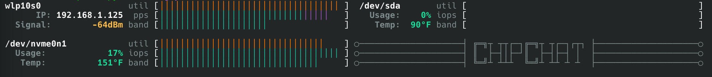

<!-- ○═════════════════════════════════════════════════════════════════════○ -->
<!-- ○═════════════════════════════════════════════════════════════════════○ -->
<!-- ○═══  ██████╗██╗  ██╗██╗██████╗  ██████╗██╗  ██╗ █████╗ ████████╗ ════○ -->
<!--      ██╔════╝██║  ██║██║██╔══██╗██╔════╝██║  ██║██╔══██╗╚══██╔══╝       -->
<!--      ██║     ███████║██║██████╔╝██║     ███████║███████║   ██║          -->
<!--      ██║     ██╔══██║██║██╔═══╝ ██║     ██╔══██║██╔══██║   ██║          -->
<!--      ╚██████╗██║  ██║██║██║     ╚██████╗██║  ██║██║  ██║   ██║          -->
<!-- ○═══  ╚═════╝╚═╝  ╚═╝╚═╝╚═╝      ╚═════╝╚═╝  ╚═╝╚═╝  ╚═╝   ╚═╝    ════○ -->
<!-- ○═════════════════════════════════════════════════════════════════════○ -->
<!-- ○═════════════════════════════════════════════════════════════════════○ -->
<!--         Copyright © 2026 Tyler J. Kenney. All rights reserved.          -->
<!-- ○═════════════════════════════════════════════════════════════════════○ -->

# ChipChat


I/O monitor showing meters for disks and network interfaces.

## Installation

```bash
ChipChat % pip install -r requirements.txt
ChipChat % pip install -e .
```

## Configuration

Create a config file at `~/.config/chipchat/config.yaml`:

```yaml
columns: 2
devices: { wlan0, nvme0n1 }
```

### Meter Configuration

Each device can have 1-3 meters. Options vary by device type:

**Disk meters:**
```yaml
meters:
  - utilization: { color: blue}        # %-util in blue
  - iops: { max: auto }                # rd+wr IOPS as a % of all-time high
  - bandwidth: { label: bw, max: 12GB} # custom label, explicit 12 GB/s max
  - blank                              # empty row for spacing
```

**Network meters:**
```yaml
meters:
  - pps {color:{read: red,write: green}} # Packets per second in Christmas colors.
  - bandwidth { halflife: 5m }           # Bandwidth with exponentially-decaying auto-scaling.
  - blank                                # Empty row for spacing
```

### Text Configuration

**Disk text:**
```yaml
text:
  - name                                    # Name of device
  - usage: { thresholds: [50%, 80%, 99%] }  # Usage rate of drive; thresholds apply different styles
                                            # Renders IFF disk.mount_points[] is set
  - temp: { downsample: 10 }                # Drive temperature; updated every 10th refresh
```

**Network text:**
```yaml
text:
  - name                                    # Name of device
  - ssid: { style: "cyan" }                 # Network SSID w. custom style
  - signal:                                 # Signal-strength w. override thresholds & styles
      thresholds:
        - {val: -50, color: blue}
        - {val: -80, color: purple}
  - ip: { style: "green" }                  # IPv4 address w. custom style
```

### Encoding Units

Scale suffices must be uppercase (`K/M/G/T`). Data quantities can be expressed in bytes (`B`) or bits (`b`).

| Format | Meaning |
|--------|---------|
| `12GB` | 12 gigabytes (per second) |
| `300MB` | 300 megabytes (per second) |
| `1Gb` | 1 gigabit (per second) |
| `auto` | Auto-scale based on observed peak |

Temperatures can be expressed in Celsius (`C`), Fahrenheit (`F`) or percentage (`%`) of registered critical drive temp (NVMe only).

## Auto-Scaling

All meters defaut to `{ max: auto }`, which means auto-scaling is enabled. This means the maximum recorded value
(i.e., total bytes read + written over the sampling period for `bandwidth` meters) since the `chipchat` process
was launched is tracked and used as the denominator for the meter.

This design means there is a "warmup" period where meters render high values shortly after startup. The recorded
peak values are displayed on exit. If desired, users can copy these values into their config as explicit maximums;
this will eliminate the warmup period on subsequent launches.

### Decaying Exponentials

If typical usage is far below the recorded all-time high, then meters may not render much or any signal. One way to
avoid this is to specify a lower explicit maximum for the meter. Another way is to enable the decaying-exponential
feature within auto-scaling mode.

If `halflife` is set for an auto-scaling meter, then the denominator used to render the meter will constantly decay
using an exponential pattern. For example, with `halflife: 10m` a meter that records 1200 MB/s spike at the top of 
the hour will use 1200 MB/s as the denominator for the very next refresh, then a sightly smaller denominator for the
next refresh, and so on. By ten minutes past the hour, the denominator will be 600 MB/s (assuming traffic has
decreased and the denominator is never exceeded). By twenty minutes past, it'll fall to 300 MB/s.

By default, network utilization meters use this feature. The default `net` utilization feature is effectively
implemented with the following configuration:
```yaml
- bandwidth: { max: auto, halflife: 60s, label: util, color: yellow}
```

